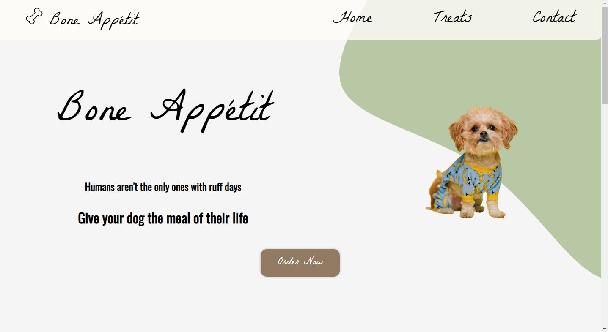

# Bone Appétit

This project was made for the knock-out round for SkillsUSA. Too many teams signed up to participate in SkillUSA
so, in order to reduce the total participants, professors at OTC created an assignment and laid out details. 
The top three teams would qualify to go to the district tournament.

## Example Output



## Analysis Steps

The overview of the task was this: 

> Your task is to create a website for a restaurant that caters to dogs. 
Yes, you read that right. It is a restaurant dining experience for furry friends.
The menu is specially catered to a delicious, fresh and healthy meal for your dog. 
There is also coffee and pastries for their humans as well.

Given this overview, we had a lot of room to work with. Unfortunately, this competition took place towards the end of the 
semester so my partner and I really had to be aware of time limitations. Nonetheless, the first thing we decided to do was create 
a Figma wireframe of the site. You can view that [here](https://www.figma.com/file/8xWBPOMhGOJIALcCqDdeMX/Chris's-Mockup?node-id=0%3A1&t=aF2g3AFsdQGnkVAd-1). 


### Design

There were a couple of stages of development. First, as you may have already read, we created the wireframe. We
approached considering both of our styles and then merged our two styles into one. You can view this in the Figma file. 

### Implementation

Step One

```
After the initial wireframe, we started splitting up the work. Since I had a bit more experience, I worked on the home page and the contact page
whilst Benjamin worked on the treats page. The first thing I developed was the navigation bar. Since this would be global to the entire page,
I felt it was necessary to complete that code first. 
```

Step Two

```
Once the navigation bar was complete, I added it to all the pages and committed it on GitHub. From that committ, my partner could begin his work on the
treats page. 
```

Step Three

```
After the three pages were developed, it was a matter of adding some formatting via CSS and a bit of functionality using JavaScript. At this point, the competition
deadline was getting near and final exams were taking place so I ran out of time to develop some extra functionality and give the styles one final touch-up.
```

## Notes

Given all of the potential issues we could have ran into, I believe this project went very well. The site is extremely simple, but it works and its simplicity gives it a 
bit of attraction to the eye. There were definitely some communication errors between my teammate and me, but that is to be expected when you're developing code with someone
that you met a few days before the competition started. 

We were able to receive feedback from the judge and there were a couple of things that stood out. 

- We should have gone with the first Figma file we had developed (it was the wireframe I created)
- The fonts we selected were slightly difficult to read
- There were a couple of buttons that did not have any particular use, which in real-world implementation, would look terrible
- The HTML for the treats page should really have been made with Flexbox or Grid (the judge actually demonstrated an extreme distaste for the way it was made)
- There was overlapping text on some areas, something that could have been fixed with CSS spacing

Even with these negatives, we were still able to come out on top with the first place. Onward to the district competition!

## Do not change content below this line
## Adapted from a README Built With

* [Dropwizard](http://www.dropwizard.io/1.0.2/docs/) - The web framework used
* [Maven](https://maven.apache.org/) - Dependency Management
* [ROME](https://rometools.github.io/rome/) - Used to generate RSS Feeds

## Contributing

Please read [CONTRIBUTING.md](https://gist.github.com/PurpleBooth/b24679402957c63ec426) for details on our code of conduct, and the process for submitting pull requests to us.

## Versioning

We use [SemVer](http://semver.org/) for versioning. For the versions available, see the [tags on this repository](https://github.com/your/project/tags). 

## Authors

* **Billie Thompson** - *Initial work* - [PurpleBooth](https://github.com/PurpleBooth)

See also the list of [contributors](https://github.com/your/project/contributors) who participated in this project.

## License

This project is licensed under the MIT License - see the [LICENSE.md](LICENSE.md) file for details

## Acknowledgments

* Hat tip to anyone who's code was used
* Inspiration
* etc
